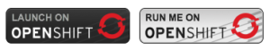

# Template description

This template provides an open source alternative to [Dropbox](https://www.dropbox.com/) or [Box](https://www.box.com/) based on [Nextcloud](https://nextcloud.com/).

## Components privisioned

| Components | Description |
| ---------- | ----------- |
| [Nextcloud](https://nextcloud.com/) | The cloud appliance |
| [MariaDB](https://mariadb.org/) | The database backend |
| A persistent volume | Requires 'Read-Write-Many' access-mode so use an appropriate storage backend. For example GlusterFS or NFS will work but currently not AWS EBS |
| [Let's Encrypt](https://letsencrypt.org/) certificate | Trusted TLS certificate to secure communication to Nextcloud |

## External documentation

- [Scalability & Design for 10k - 20k users](https://indico.cern.ch/event/565381/contributions/2400781/attachments/1405256/2146669/20170131-1_Nextcloud_Scalability_with_a_concept_design_for_10-20.000_users.pdf)
